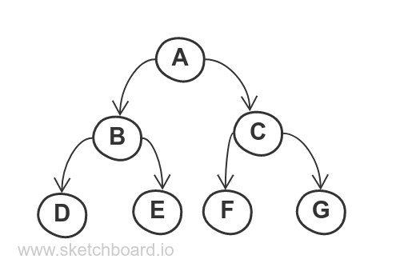

# Tree traversal

Here we are going to play a bit with tree traversal algorithms. Have a look at the tree below:


## Pre-order traversal
This traversal algorithm will visit every node in the following order:
 1. Root
 1. Left
 1. Right

 So, for our tree it would be:
 ```
 A->B->D->E->C->F->G
 ```

## In-order traversal
This traversal algorithm will visit every node in the following order:
 1. Left
 1. Root
 1. Right

 So, for our tree it would be:
 ```
D->B->E->A->F->C->G
 ```

## Post-order traversal
This traversal algorithm will visit every node in the following order:
 1. Left
 1. Right
 1. Root

 So, for our tree it would be:
 ```
D->E->B->F->G->C->A
 ```

 # Parse tree
 Parse tree allows parsing and understanding expressions, such as mathematical expressions or sentences. More info: https://runestone.academy/ns/books/published/pythonds/Trees/ParseTree.html

 